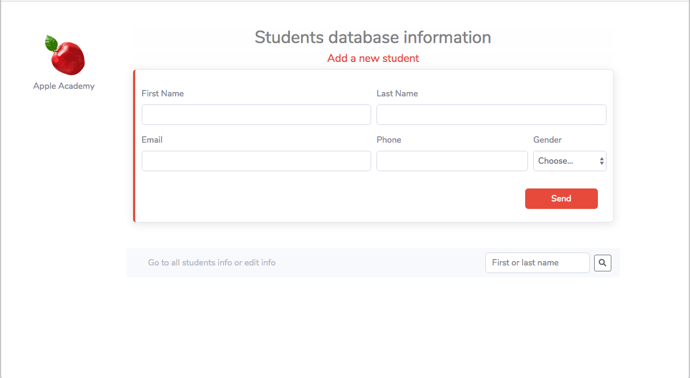
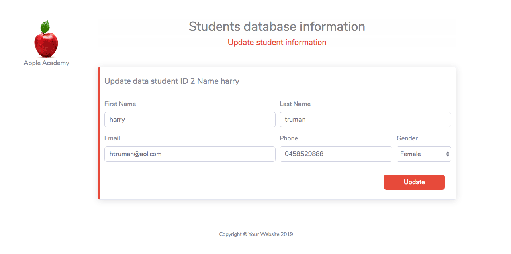
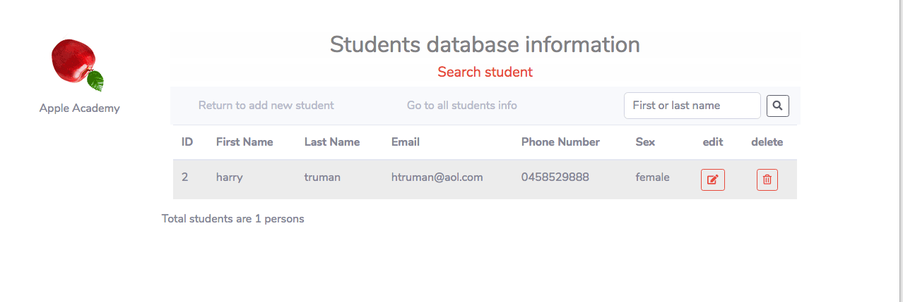
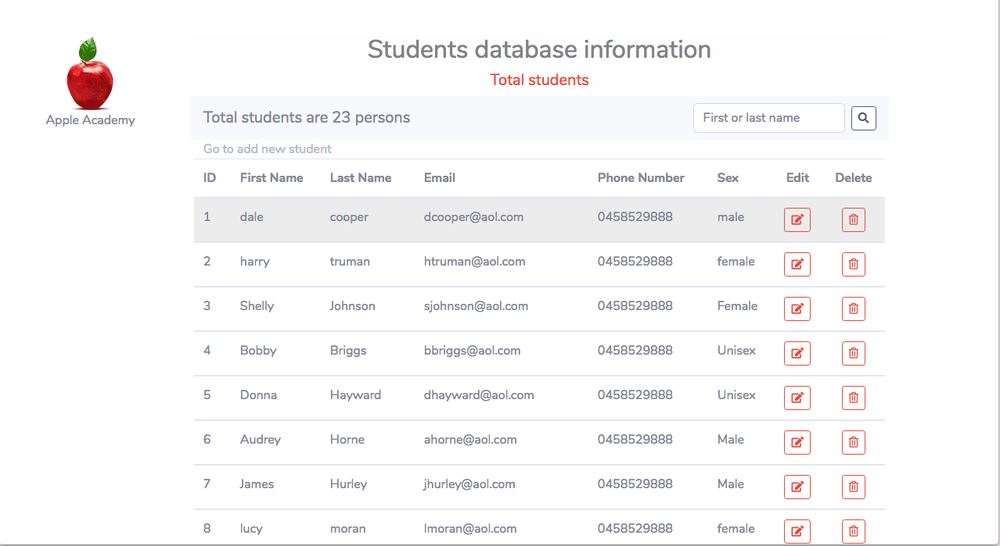
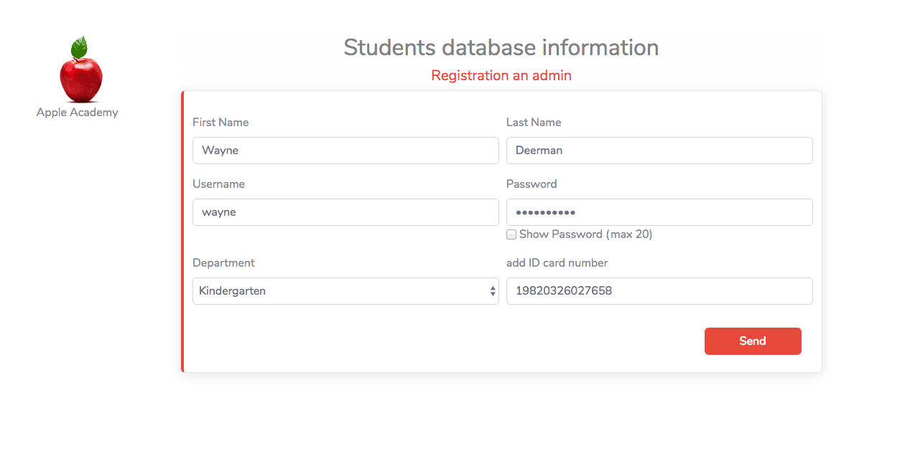
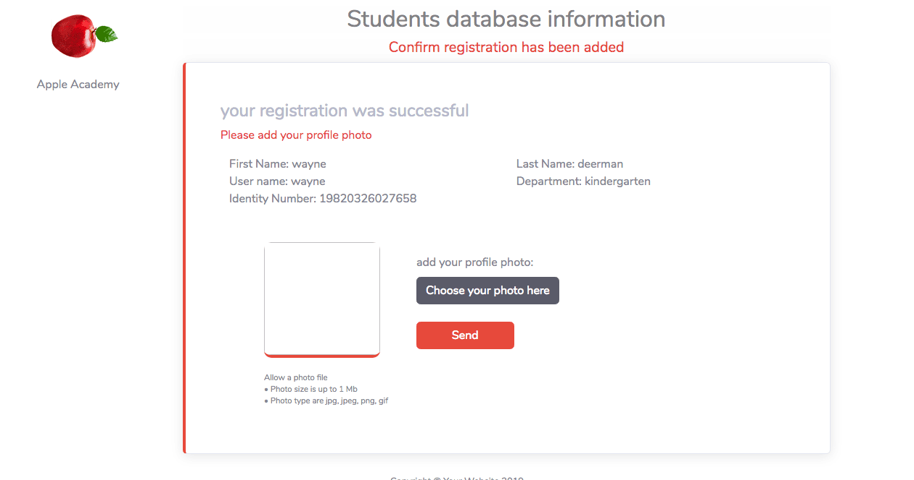
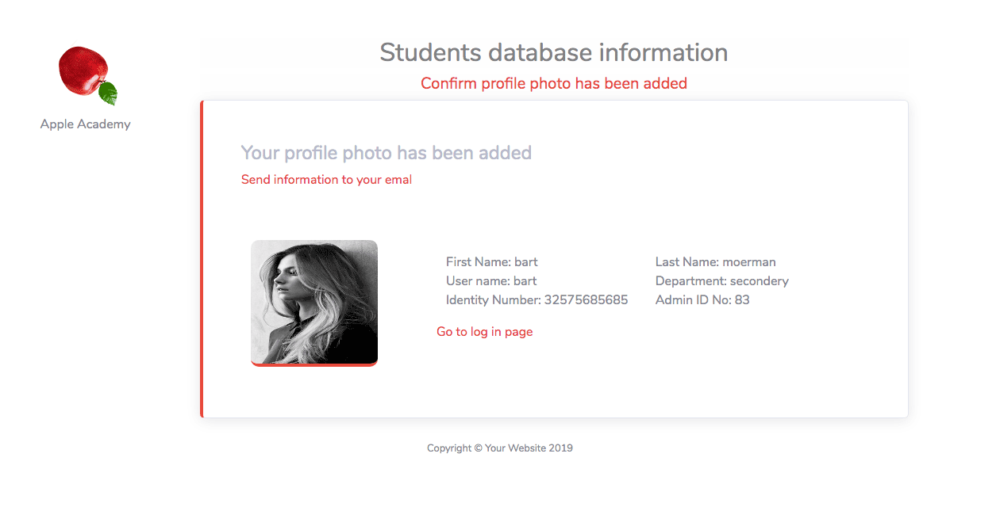

# CRUDform
<h2>Project from PHP with database mySQL.</h2>
This project propose to learn about create read update and delete. 
The project is a student database information.

I have made the Database name: studentweb. 
Tablename: students 
with 7 columns 
id, first_name, last_name, email, phone, sex, date_in(for to use later) 

<h3><li>main pages is addstudent.php</li></h3>

- insert a student information in to the database. 
- search bar to search from student first name and last name 
<li>getstudentinfo.php</li>
- show all the information form the database 

 
 
 
 
 
 
 
 
 

